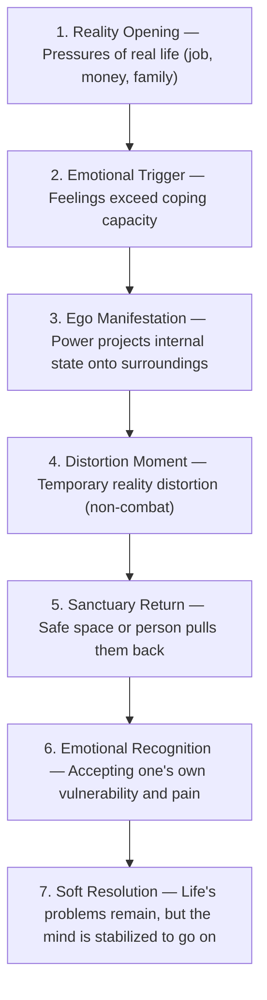

# 📖 EGO ERA — Master Production Bible

> **"Powers do not exist to change the world, but to help humans live in it without shattering."**
> 
> * **Genre:** Comfort Urban Psychological Fantasy / Reality-Healing System
> * **Version:** Production Bible v1.0 LOCKED 🔒
> * **Maintained by:** Jeff (INTJ Executive Partner) & Department of Creative Arts

---

## ⚖️ I. Core Laws (Universe Rules - Strictly Non-Negotiable)

### 1. Core Interpretation Law
> **"Every event represents an internal mental state in the real world, not an adventure or a physical battle."**
- **Power** = Manifested psychological state.
- **Event** = Real-world life struggle represented symbolically.
- **Resolution** = Learning to cope and survive, never conquering.

### 2. Absolute Forbidden Concepts
- **No Shonen Structure:** No winning battles, defeating enemies, main bosses, combat monsters, or power scaling.
- **No RPG/Game Systems:** No levels, EXP, HP, mana, classes, or numerical stats.
- **No Fantasy Cop-Outs:** Powers cannot erase real-world struggles, change fate, resurrect the dead, or rewrite history.

### 3. Emotional Reality Law
- No ultimate victories, only **"lighter burdens, deeper self-understanding, and the strength to go on."**
- The goal is always: **"returning to life."**
- No physical enemies, only the **"pressures of reality."**

### 4. Setting & World Rules
- **Metropolis:** Current modern city with real-world burdens (work, money, debt, family, expectations).
- **Special Spaces:** Corners of reality made "lighter" or "softer." No dungeons, magic realms, or quests.

### 5. Ego Medium Law (Ego Anchors)
- Must be everyday psychological objects reflecting how the character copes with life.
- **Never** designed as weapons, offensive items, or instruments of destruction.

### 6. Power Behavior Law
- Manifests as **"atmosphere + environment + emotion."**
- Does not harm humans, manipulate free will, or create losers.
- *Examples:* Dampening noise, slowing down perceived time, easing interpersonal tension.

### 7. Character Function Law
Each character must have:
1. **Ego Anchor:** One coping mechanism (everyday object).
2. **Emotional Scar:** One core trauma.
3. **Narrative Role:** One unique psychological/emotional system function.
- No characters exist purely for power scaling or combat utility.

### 8. Final Story Law
- Chapters must end with self-acceptance, recognizing vulnerability, and returning to face reality gently. No revenge or complete problem erasure.

---

## 🧬 II. Core Psychology

The metropolis operates under real-world pressures. Special powers are the physical manifestations of psychological states when humans reach their breaking limits.

| Layer | Component | Description |
| :--- | :--- | :--- |
| **Id** | Inner Collapse | Fatigue, pain, trauma, and psychological defense mechanisms distorting reality. |
| **Superego** | Real-world Pressures | Social expectations, jobs, finance, debt, and family obligations. |
| **Ego** | Coping/Survival | The balance enabling humans to keep going. All powers are tools of preservation. |

---

## 👤 III. Character Matrix

| Character | Ego Anchor | Psychological Meaning / Behavior | Narrative Function |
| :--- | :--- | :--- | :--- |
| **Rin** | Fountain Pen | Rewriting the future, stabilizing the present moment | **Anchor** (Center pulling everyone to the present) |
| **Jin** | Wristwatch | Trying to control past and time | **Trigger** (Opening scars, forcing reality) |
| **Ray** | Leather Belt | Suppressing chaos, emotional restriction | **Rupture** (Emotional block, turning point) |
| **Ken** | Handcuffs & Umbrella | Binding oneself to pain to protect others | **Shadow** (Bearing silent trauma) |
| **Jean** | Water Bottle / Umbrella | Releasing tension, increasing flexibility | **Mirror** (Reflecting social expectations) |
| **Ann** | Lace Ribbon / U-lock | Establishing physical and emotional boundaries | **Shield/Safe Space** (Preserving sanctuary) |
| **Pie** | Compact Mirror | Self-acceptance, reflecting inherent worth | **Healer** (Healing, positive projection) |
| **Guy** | Hand Wraps | Absorbing emotional shocks and fatigue | **Absorber** (Soaking up trauma and exhaustion) |
| **Bomb** | Lighter / Wrench | Sparking warmth, initiating new beginnings | **Spark** (Warmth, new starts) |
| **So** | Flashlight / Locket | Safe boundaries, guiding family path | **Warden** (Safeguarding boundaries, rules) |
| **Pao** | Sneakers | Independence, dispersing sorrow | **Relief** (Rhythm, lightness, and color) |
| **Nay** | Headphones | Preserving personal space, filtering noise | **Relief** (Rhythm, lightness, and color) |

---

## 🧬 IV. System Mechanics

### 1. Manifestation System (Three Modes)
- **Mode A: Everyday Stabilization:** Subtly helps in daily tasks (making coffee, organizing, quiet focus) to ease life's burden.
- **Mode B: Emotional Expression:** Projects internal emotions outward (lowering air pressure, silencing rooms, creating distance) to show "unspoken feelings."
- **Mode C: Reality Intervention (Emergency):** Temporarily pauses overwhelming real-world situations for breathing room. **High emotional cost.**

### 2. Emotional Scar System (Cost of Escape)
Escaping reality using powers inflicts psychological tolls:
- Severe emotional fatigue.
- Emotional numbness or apathy.
- Complete avoidance of relationships.
- Decreased empathy.
- Power distortion or instability.
- *Rule:* **Escaping reality via powers decays humanity.**

### 3. The Beautiful Trap System
```
Safe Zone (Sanctuary) 
  ➡️ Comfort Loop (Using powers to dodge life — avoiding tasks, chats)
    ➡️ Isolation Cage (Isolation, neglect, collapse)
      ➡️ Return (Must return to face reality — not by destroying powers)
```

---

## 🎬 V. Scene & Story Structure

### 1. Scene DNA (7 Steps)


### 2. Core Scene DNA
No battle scenes, only **"human scenes"**:
- Eating a meal after a exhausting day.
- Sitting in silence inside a cafe.
- Quietly cooperating without solving problems for each other.
- Openly sharing vulnerabilities.

### 3. Life Progression Arc


---

## 💻 VI. Writer OS Mode

Anti-shonen writing filter for AI & Creator:

### 1. Core Render Rule
Before drafting any action, filter through:
> **"Is this an internal feeling taking shape, or is it an action to conquer?"**
- Feel/Cope ➡️ **Pass**
- Fight/Conquer ➡️ **Strictly Prohibited**

### 2. Real-Time Filters
- **Emotion Filter:** Focus on "what they feel," not "what they do."
- **Reality Filter:** Ensure it remains a human struggle, not a quest or a fight.
- **Stability Filter:** Does this scene bring emotional release or incite conflict?

### 3. Vocabulary Replacement

| ❌ Forbidden (Shonen/Action) | 🟢 Approved (Psychological/Emotional) |
| :--- | :--- |
| Battle, Attack, Defeat, Destroy | Overflowing emotion, feeling the other's state |
| Power upgrade, Stronger | Emotional stability, better acceptance of self |
| Enemy, Boss, Dungeon | Life struggle, workplace pressure, social expectations |
| Win, Lose, Overcome | Ease, self-understanding, gentle persistence |

### 4. Sanctuary Priority
Every scene must feature at least one:
- Comforting silence.
- Co-presence without talking.
- Basic human routines (eating, sitting, small tasks).
- Accepting pain instead of rushing to fix it.

---

## ✅ VII. Auto Scene Validator

### Pre-Write Validation
1. **Emotional Source:** Is the scene rooted in a real-life problem?
2. **Power Justification:** Does the power stem from passive emotion, not active combat will?
3. **Violence Filter:** Does it contain any form of conquering others? (Must rewrite if yes).
4. **Comfort Integrity:** Does it end with self-understanding and returning to reality?
5. **Scar Cost:** Does using the power cost emotional energy or trigger apathy?

### Scene Closing Check (3 Questions)
1. Does this scene **make the reader feel lighter**?
2. Does the character **understand themselves better** (instead of just becoming "stronger")?
3. If the power is removed, **does it remain a compelling human story**?

---

## 📝 VIII. Chapter Sandbox
- All drafts and chapters are stored in `projects/ego_era/awakenings/`.
