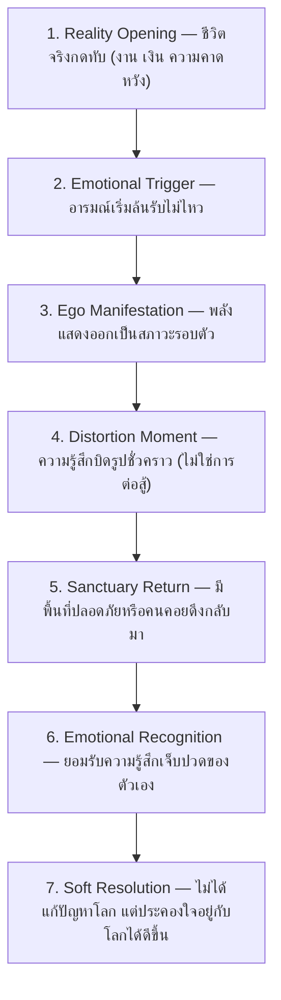
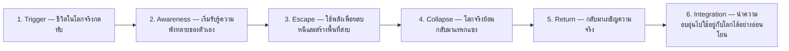

# 📖 EGO ERA — Master Production Bible

> **"พลังในโลกนี้ไม่ได้มีไว้เพื่อเปลี่ยนโลก แต่มีไว้เพื่อให้มนุษย์กลับไปอยู่กับโลกได้ โดยไม่แตกสลาย"**
> 
> * **Genre:** Comfort Urban Psychological Fantasy / Reality-Healing System
> * **Version:** Production Bible v1.0 LOCKED 🔒
> * **Maintained by:** Jeff (INTJ Executive Partner) & Department of Creative Arts

---

## ⚖️ I. Core Laws (กฎเหล็กจักรวาล — ห้ามละเมิดเด็ดขาด)

> เอกสารนี้ไม่ใช่การเล่าโลก แต่เป็น **"กฎบังคับการใช้งานจักรวาล"** สำหรับการเขียนนิยาย EGO ERA ทุกกรณี ห้ามละเมิด ห้ามตีความย้อนกลับ ห้ามใช้โทนอื่นแทรก

### 1. Core Interpretation Law (กฎการตีความจักรวาล)
จักรวาล EGO ERA ต้องถูกตีความตามหลักเดียวเท่านั้น:
> ❝ ทุกเหตุการณ์คือสภาวะทางใจที่เกิดขึ้นในโลกจริง ไม่ใช่การผจญภัยหรือการต่อสู้ ❞
* **พลัง** = สภาวะจิตใจที่ "แสดงออก"
* **เหตุการณ์** = ปัญหาชีวิตจริงในรูปแบบเชิงสัญลักษณ์
* **การแก้ไข** = การประคองตัวเอง ไม่ใช่การเอาชนะ

### 2. Absolute Forbidden Concepts (สิ่งต้องห้ามแบบถาวร)
* **❌ ห้ามโครงสร้างโชเน็น:** ห้ามมีการชนะการต่อสู้, ห้ามมีการแพ้หรือการกำจัดศัตรู, ห้ามมีบอส ศัตรูหลัก หรือมอนสเตอร์เชิงต่อสู้, ห้ามมีการ "อัปเกรดพลังเพื่อสู้เก่งขึ้น"
* **❌ ห้ามระบบเกมหรือ RPG:** ห้ามมีเลเวล, EXP, สกิลเทียร์, ห้ามมีค่าดาเมจ, HP, มานาในเชิงตัวเลข, ห้ามมีการจัดคลาสนักสู้
* **❌ ห้ามการแก้ปัญหาแบบแฟนตาซี:** ห้ามลบปัญหาชีวิตจริงด้วยพลัง, ห้ามเปลี่ยนชะตาชีวิตอย่างถาวร, ห้ามฟื้นคืนคนตายหรือแก้ประวัติศาสตร์

### 3. Emotional Reality Law (กฎความจริงทางอารมณ์)
> ❝ พลังมีไว้เพื่อ "ทำให้ความรู้สึกอยู่ได้" ไม่ใช่เพื่อทำให้โลกเปลี่ยน ❞
* ไม่มีชัยชนะ มีแต่ **"เบาลง / เข้าใจมากขึ้น / อยู่ต่อได้"**
* ไม่มีจุดจบแบบปิดเกม มีแต่ **"กลับไปใช้ชีวิตได้อีกครั้ง"**
* ไม่มีศัตรู มีแต่ **"แรงกดดันของชีวิตจริง"**

### 4. Setting & World Rules (กฎโลกและพื้นที่)
* **เมือง:** คือมหานครโลกปัจจุบันยุคปกติ (ไม่ใช่แฟนตาซีโลกคู่ขนาน) ที่ผู้คนเต็มไปด้วยแรงกดทับจากชีวิตจริง (งาน, เงิน, หนี้, ครอบครัว, ความคาดหวัง)
* **พื้นที่พิเศษ:** มุมของชีวิตจริงที่ถูก "ทำให้เบาลง"
* **ไม่มี**ดันเจี้ยน / **ไม่มี**ภารกิจ / **ไม่มี**โลกเวทมนตร์แยก
* สถานที่ทั้งหมดต้องเป็น: **"พื้นที่ของมนุษย์ที่กำลังพยายามอยู่ต่อ"**

### 5. Ego Medium Law (กฎสื่อกลางอัตตา)
ทุก "สื่อกลาง" ต้อง:
* เป็นของใช้ในชีวิตจริง
* มีความหมายทางจิตวิทยา
* สะท้อน "วิธีที่ตัวละครรับมือชีวิต"
* **ห้าม:** เป็นอาวุธโดยกำเนิด, ถูกออกแบบเพื่อฆ่าหรือทำลาย, มีรูปแบบที่เน้นพลังโจมตี
* **เมื่อแปรสภาพ:** ต้องกลายเป็น "เครื่องมือของการประคองใจ" ไม่ใช่อาวุธสงคราม

### 6. Power Behavior Law (กฎพฤติกรรมพลัง)
พลังต้องทำตามนี้เสมอ:
* แสดงออกเป็น **"อารมณ์ + สภาพแวดล้อม"**
* ไม่ทำร้ายคนโดยตรง
* ไม่บังคับเจตจำนงผู้อื่น
* ไม่ทำให้เกิดผู้แพ้
* **ตัวอย่างที่ถูกต้อง:** ทำให้เสียงเบาลง, ทำให้พื้นที่รู้สึกปลอดภัยขึ้น, ทำให้เวลา "รู้สึกช้าลง", ทำให้ระยะระหว่างคน "ไม่ตึงเครียด"

### 7. Character Function Law (กฎบทบาทตัวละคร)
ตัวละครทุกตัวต้องมี:
* **1 วิธีรับมือชีวิต** (Ego Anchor)
* **1 บาดแผลทางใจ** (Emotional Scar)
* **1 หน้าที่ในระบบอารมณ์เรื่อง** (Narrative Role)
* **ห้าม:** ตัวละครที่มีบทเพื่อ "เก่งกว่า", ตัวละครที่ดำรงอยู่เพื่อสู้หรือ Power Scaling, ตัวละครที่ไม่มี Emotional Function

### 8. Final Story Law (กฎบทสรุปทุกตอน)
> ❝ ตัวละครต้องกลับไปใช้ชีวิตจริงได้ โดยมีความรู้สึกที่เบาลง ไม่ใช่โลกที่เปลี่ยนไป ❞
* **ห้ามจบด้วย:** การชนะ, การล้างแค้น, การแก้ปัญหาแบบสมบูรณ์
* **ต้องจบด้วย:** การเข้าใจตัวเอง, การยอมรับความไม่สมบูรณ์, การอยู่ต่อได้อย่างอ่อนโยน

---

## 🧬 II. Core Psychology (โครงสร้างจิตหลัก)

โลกของ EGO ERA คือมหานครยุคปัจจุบันที่ภายนอกปกติ แต่ภายในมนุษย์เต็มไปด้วยแรงกดทับจากชีวิตจริง พลังพิเศษไม่ใช่เวทมนตร์ แต่คือ **"รูปธรรมของสภาวะจิตเมื่อมนุษย์ถึงขีดจำกัดของการรับมือชีวิต"**

| Layer | ชื่อ | คำอธิบาย |
| :--- | :--- | :--- |
| **Id** | ภาวะพังทลายภายใน | ความล้า ความเจ็บ การพังทลายทางใจ และกลไกเอาตัวรอดที่บิดโลกให้พออยู่ได้ |
| **Superego** | แรงกดทับโลกจริง | ระบบชีวิตจริง เช่น งาน เงิน หนี้ ครอบครัว กฎหมาย ความคาดหวัง |
| **Ego** | การประคองตัวเอง | จุดที่มนุษย์ยัง "อยู่ต่อได้" — พลังทั้งหมดคือเครื่องมือประคอง ไม่ใช่เครื่องมือชนะ |

---

## 👤 III. Character Matrix (ระบบบทบาทตัวละคร)

ทุกคนมี **"Ego Anchor" (สื่อกลางอัตตา)** ซึ่งต้องเป็นของใช้ในชีวิตจริงที่มีความหมายทางจิตวิทยา สะท้อนวิธีรับมือชีวิต (ห้ามเป็นอาวุธโดยกำเนิด) และมีหน้าที่ในระบบอารมณ์เรื่องที่ชัดเจน:

| ตัวละคร | Ego Anchor (สื่อกลางอัตตา) | ความหมายทางจิตวิทยา / พฤติกรรม | Narrative Function |
| :--- | :--- | :--- | :--- |
| **ริน (Rin)** | ปากกาหมึกซึม | เขียนอนาคตใหม่และประคองช่วงเวลาปัจจุบัน | **Anchor** (ศูนย์กลางที่พาทุกคนกลับสู่ปัจจุบัน) |
| **จิน (Jin)** | นาฬิกาข้อมือ | พยายามควบคุมอดีตและเวลาในชีวิตที่ยากจะควบคุม | **Trigger** (ตัวเปิดแผล/กระตุ้นเผชิญความจริง) |
| **เรย์ (Ray)** | เข็มขัดหนัง | ควบคุมอารมณ์และกดทับความวุ่นวาย | **Rupture** (การปิดกั้นอารมณ์และจุดเปลี่ยน) |
| **เคน (Ken)** | กุญแจมือ (และร่ม) | ผูกตัวเองกับความเจ็บเพื่อปกป้องคนอื่น | **Shadow** (การแบกรับความเจ็บปวดเงียบงัน) |
| **จีน (Jean)** | กระบอกน้ำ / ร่มพับ | การระบายความตึงเครียดและเพิ่มความยืดหยุ่น | **Mirror** (สะท้อนแรงกดทับความคาดหวังสังคม) |
| **แอน (Ann)** | ริบบิ้นลูกไม้ / กุญแจยูล็อค | สร้างขอบเขตความปลอดภัย | **Shield/Safe Space** (ผู้โอบอุ้มพื้นที่ปลอดภัย) |
| **พาย (Pie)** | ตลับแป้งกระจก | การยอมรับและสะท้อนคุณค่าในตัวเอง | **Healer** (การเยียวยาและมองโลกแง่บวก) |
| **กาย (Guy)** | ผ้าพันมือ | รับแรงกระแทกทางอารมณ์และบรรเทาความเหนื่อยล้า | **Absorber** (ซึมซับความเหนื่อยล้าทางอารมณ์) |
| **บอม (Bomb)** | ไฟแช็ก / ประแจ | ไออุ่นและการจุดประกายชีวิต | **Spark** (พลังการเริ่มต้นใหม่และประกายไออุ่น) |
| **โซ (So)** | ไฟฉายเหล็ก / ล็อกเกต | ขอบเขตการหายใจและการส่องนำทางครอบครัว | **Warden** (ดูแลขอบเขตความปลอดภัย/รักษากฎ) |
| **เปา (Pao)** | รองเท้าผ้าใบ | ความเป็นอิสระและการปัดเป่าความเศร้า | **Relief** (การสร้างจังหวะชีวิต ความเบา และสีสัน) |
| **เน (Nay)** | หูฟังครอบหู | การรักษาสเปซและการพักใจจากเสียงรบกวน | **Relief** (การสร้างจังหวะชีวิต ความเบา และสีสัน) |

### Narrative Function Groups

**แกนหลัก (Core Duo)**
* **Anchor (ริน):** ศูนย์กลางที่พาทุกคนกลับสู่ปัจจุบัน
* **Trigger (จิน):** ตัวเปิดแผล ความทรงจำ และกระตุ้นให้เผชิญความจริง

**ตัวสะท้อน (Mirrors)**
* **Rupture (เรย์):** การปิดกั้นอารมณ์และจุดเปลี่ยน
* **Shadow (เคน):** การแบกรับความเจ็บปวดอย่างเงียบงัน
* **Mirror (จีน):** การสะท้อนแรงกดทับและความคาดหวังของสังคม
* **Shield/Safe Space (แอน):** ผู้โอบอุ้มพื้นที่ปลอดภัย
* **Healer (พาย):** การเยียวยาและการมองโลกในแง่บวก
* **Absorber (กาย):** การรับภาระและซึมซับความเหนื่อยล้าทางอารมณ์

**ตัวประคอง (Stabilizers)**
* **Spark (บอม):** พลังแห่งการเริ่มต้นใหม่และประกายไออุ่น
* **Warden (โซ):** การดูแลขอบเขตความปลอดภัยและรักษากฎ
* **Relief (เปา & เน):** การสร้างจังหวะชีวิต ความเบา และสีสัน

---

## 🧬 IV. System Mechanics (กลไกระบบ)

### 1. ระบบการแสดงพลัง (Manifestation System)
พลังจะแสดงออกเป็น **"อารมณ์ + สภาพแวดล้อม"** ไม่ทำร้ายคนโดยตรง ไม่บังคับเจตจำนงผู้อื่น และไม่ทำให้เกิดผู้แพ้

| Mode | ชื่อ | คำอธิบาย |
| :--- | :--- | :--- |
| **A** | Everyday Stabilization | ช่วยในกิจวัตรประจำวัน (ชงกาแฟ, จัดของ, ทำงานเงียบๆ) ทำให้ชีวิตเบาลง |
| **B** | Emotional Expression | พลังแสดงสภาวะจิตออกมาเป็นรูปธรรม (ลดแรงกดอากาศ, สร้างพื้นที่เงียบ, เพิ่มระยะห่างกันเพื่อไม่ให้กระทบกระทั่ง) — ไม่มีผู้แพ้ มีแต่ "อารมณ์ที่ถูกเห็น" |
| **C** | Reality Intervention (ฉุกเฉิน) | ใช้หยุดสถานการณ์โลกจริงที่กดดันเกินไปชั่วคราวพอให้ "หายใจได้" — **มีราคาทางใจสูงทุกครั้ง** |

### 2. Emotional Scar System (ระบบราคาทางใจ)
ทุกครั้งที่ใช้พลังเพื่อ **"หนีชีวิตจริง"** จะต้องแลกด้วยสิ่งที่ไม่ใช่ค่าพลังลดลง แต่เป็นสภาวะจิตที่เปลี่ยนไป:
* **เหนื่อยล้าทางใจรุนแรง**
* **ความชาเฉยทางอารมณ์ (Emotional Numbness)**
* **การหลีกเลี่ยงความจริง / ตัดขาดความสัมพันธ์**
* **Empathy (ความเข้าอกเข้าใจ) ลดลง**
* **พลังเริ่มบิดเบี้ยวหรือใช้ไม่ได้**
* ❝ ยิ่งใช้พลังเพื่อหนีชีวิตจริง → ยิ่งสูญเสียความเป็นมนุษย์ทีละน้อย ❞

### 3. The Beautiful Trap System (กับดักความสบาย)
```
Safe Zone (พื้นที่พักใจ)
  ➡️ Comfort Loop (ใช้พลังหนีโลก — เลื่อนงาน ไม่ตอบแชท ไม่กลับโลกจริง)
    ➡️ Isolation Cage (โดดเดี่ยว ลืมกินข้าว เงินหมด)
      ➡️ [ทางออกเดียวคือ] Return (ต้องกลับไปเผชิญชีวิตจริงเท่านั้น — ไม่ใช่การทำลายพลัง)
```

### 4. Hard Emotional Laws (กฎเหล็กจักรวาล — สรุป)
* ไม่มีศัตรูหลัก → มีแต่ **"สถานการณ์ชีวิต"**
* ไม่มีการเอาชนะ → มีแต่ **"เข้าใจและอยู่ต่อ"**
* พลังไม่แก้ชีวิตจริง → ไม่สร้างเงิน ไม่ย้อนชีวิต ไม่ลบอดีต
* พลังมีไว้เพื่อ **"พากลับไปใช้ชีวิตจริงโดยไม่พัง"**

---

## 🎬 V. Scene & Story Structure (โครงสร้างฉากและเรื่องราว)

### 1. Scene DNA Structure (กฎโครงสร้างฉาก — 7 ขั้นตอน)
ทุกตอนต้องดำเนินตามขั้นตอนนี้อย่างเป็นระบบ:


### 2. Core Scene DNA (แกนฉากของเรื่อง)
ไม่มี "ฉากต่อสู้" มีแต่ **"ฉากมนุษย์"**:
* กินข้าวหลังวันที่พัง
* นั่งเงียบในคาเฟ่
* ใช้พลังทำงานเล็กๆ
* เปิดใจคุยเรื่องเจ็บปวด
* อยู่ด้วยกันโดยไม่ต้องพยายามแก้ปัญหาให้กัน

### 3. Life Progression Arc (วงจรชีวิตของเรื่องราว)


---

## 💻 VI. Writer OS Mode (คู่มือนักเขียนสำหรับ AI & เปรม)

> **"โหมดล็อกความคิดเพื่อป้องกัน Shonen Leak / ต่อสู้ / โทนที่เร้าเกินไป"**
> ระบบนี้คือ "โหมดทำงานของนักเขียน" ไม่ใช่กฎโลก — ใช้เพื่อคุมไม่ให้หลุดไปเป็นโชเน็น แอ็กชัน หรือแฟนตาซีต่อสู้ในขณะเขียน

> 📎 **ตัวอย่างงานเขียนที่อนุมัติแล้ว (Approved Style Reference):** `knowledge/personal/novel/ego_era_style_reference.md`
> ก่อนเขียนทุกครั้ง ให้อ่านตัวอย่างนั้นเพื่อ calibrate โทน

### 1. Core Render Rule (กฎเรนเดอร์ความคิด)
ก่อนสร้างคำหรือประโยค ให้ผ่านฟิลเตอร์นี้เสมอ:
> ❝ นี่คือ **"ความรู้สึกที่กำลังเกิดขึ้น"** หรือ **"การกระทำเพื่อเอาชนะ"**? ❞
* ถ้าเป็นความรู้สึก ➡️ **ผ่านได้**
* ถ้าเป็นฉากต่อสู้/ปะทะ/เอาชนะ ➡️ **ห้ามเขียนเด็ดขาด**

### 2. Real-Time Filter (ตัวกรองระหว่างเขียน — 3 ชั้น)
ก่อนเขียนทุกบรรทัด ให้เช็คผ่าน 3 Layer:
* **Layer 1 — Emotion Check:** ฉากนี้กำลัง "รู้สึกอะไร" ไม่ใช่ "กำลังทำอะไร"
* **Layer 2 — Reality Anchor Check:** มันยังเป็น "ชีวิตจริงของมนุษย์" อยู่ไหม? หรือเริ่มกลายเป็น "ภารกิจ / ฉากต่อสู้"
* **Layer 3 — Comfort Stability Check:** ฉากนี้ทำให้ "อยู่ต่อได้ดีขึ้น" หรือ "เร้าให้สู้"

### 3. Shonen Leak Detection (คำที่ต้องหลีกเลี่ยง & คำแทนที่)

| ❌ คำต้องห้าม (Trigger Words) | 🟢 คำแทนที่ทางความรู้สึก (Replacement Thinking) |
| :--- | :--- |
| สู้ / ปะทะ / โจมตี / กำจัด | รับรู้ความรู้สึกของอีกฝ่าย / อารมณ์ล้นทะลัก |
| พลังอัปเกรด / แข็งแกร่งขึ้น | สภาวะใจมั่นคงขึ้น / ยอมรับอารมณ์ได้ดีขึ้น |
| ศัตรู / บอส / ดันเจี้ยน | อุปสรรคชีวิตจริง / แรงกดดันของโลกการทำงาน |
| ชนะ / แพ้ / ล้มเพื่อแกร่งขึ้น | เบาลง / เข้าใจตัวเอง / ประคองตัวเองอยู่ต่อได้ |

### 4. Scene Generation Rule (กฎสร้างฉาก)
ทุกฉากต้องเริ่มจาก: ❝ ชีวิตจริงที่กดทับ → ไม่ใช่พลัง ❞
1. คนเหนื่อย / เครียด / พัง / ล้า (Reality Input)
2. ความรู้สึกเริ่มล้น (Emotional Pressure)
3. พลังเกิดขึ้นแบบ "ไม่ตั้งใจ" (Passive Manifestation)
4. โลก "เบาลง" ไม่ใช่ "ถูกเปลี่ยน"
5. กลับไปใช้ชีวิตได้อีกครั้ง

### 5. Power Render Rule (กฎการแสดงพลัง)
เวลาจะเขียน "พลัง" ให้ถามก่อน:
> ❝ ถ้าตัดคำว่า "พลัง" ออก ฉากนี้ยังเข้าใจอารมณ์ไหม? ❞
* ถ้า "ใช่" → เขียนต่อได้
* ถ้า "ไม่" → แสดงว่าพลังกำลังเป็น action system → **ต้อง rewrite**

### 6. Sanctuary Priority Rule (กฎพื้นที่ปลอดภัย)
ทุกฉากต้องมีอย่างน้อย 1 อย่าง:
* ความเงียบ
* การอยู่ด้วยกันโดยไม่พูด
* กิจวัตรธรรมดา (กิน / นั่ง / ทำงานเล็กๆ)
* การ "ไม่แก้ปัญหา แต่ยอมอยู่กับมัน"
* ⚠️ **ถ้าฉากไม่มีสิ่งเหล่านี้ → เสี่ยงหลุดโทน**

### 7. Emotional Cost Reminder (ตัวเตือนราคาทางใจ)
> ❝ พลังทุกครั้งต้องแลกด้วยความรู้สึก ไม่ใช่ความเก่ง ❞
ถ้าฉากกำลัง เท่ขึ้น / เร้าใจขึ้น / เร็วขึ้น / ใหญ่ขึ้น → ให้หยุดและถาม: **"มันกำลังหนีความรู้สึกอยู่หรือเปล่า?"**

### 8. Character Voice Rule (กฎเสียงตัวละคร)
ตัวละคร **"ห้ามพูดเหมือนตัวละครต่อสู้"**
* ✅ **ต้องเป็น:** คนเหนื่อย, คนที่พยายามอยู่ต่อ, คนที่ไม่รู้จะพูดอะไรดี
* ❌ **ห้ามเป็น:** นักสู้, ผู้ประกาศพลัง, คนพูดเท่ๆ เพื่อปูดราม่า

### 9. Writer State Rule (กฎสภาพนักเขียน)
ก่อนเขียนทุกฉาก ให้ล็อก mindset นี้:
> ❝ ฉันไม่ได้กำลังสร้างฉากต่อสู้ ฉันกำลังสังเกตมนุษย์ที่พยายามอยู่รอดในวันธรรมดา ❞

### 10. Hard Exit Rule (กฎป้องกันหลุดสุดท้าย)
ถ้าเขียนแล้วรู้สึกว่า:
* เริ่มมันส์เกินไป
* เริ่มอยากเพิ่มฉากปะทะ
* เริ่มอยากทำให้ตัวละครเก่งขึ้น

**→ ย้อนกลับไป 1 อย่างเท่านั้น:** "ลดขนาดของฉากลง ไม่เพิ่มขนาดของพลัง"

---

## ✅ VII. Auto Scene Validator (ตัวตรวจฉากก่อนปล่อย)

ใช้เช็คทุกตอนก่อนเขียนจริงและก่อนจบฉาก:

### Pre-Write Validation (5 Steps)
| Step | Check | คำถาม |
| :--- | :--- | :--- |
| 1 | Emotional Source Check | ฉากนี้เกิดจาก "ปัญหาชีวิตจริง" หรือยัง? |
| 2 | Power Justification Check | พลังเกิดจาก "สภาวะใจ" ไม่ใช่ "อยากใช้พลัง"? |
| 3 | Violence Filter | มี "การเอาชนะคนอื่น" ไหม? (ถ้ามี = ต้องแปลงเป็น emotional symbolism) |
| 4 | Comfort Integrity Check | ตอนจบยัง "กลับสู่ความสงบ/การยอมรับชีวิตจริง" หรือไม่? |
| 5 | Scar Cost Check | มี "ราคาทางใจ" หรือผลกระทบต่ออารมณ์หรือไม่? |

### Final System Check (ก่อนจบฉาก — 3 คำถาม)
1. ฉากนี้ **"ทำให้คนรู้สึกเบาลง"** หรือหนักขึ้น?
2. ตัวละคร **"เข้าใจตัวเองขึ้น"** หรือแค่ "เก่งขึ้น"?
3. ถ้าตัดพลังออก **ฉากนี้ยังเป็นมนุษย์ไหม?**

> ⚠️ **ถ้าตอบไม่ผ่านข้อใดข้อหนึ่ง → REWRITE**

---

## 🔒 FINAL LOCK PRINCIPLE

> ❝ **พลังในโลกนี้ไม่ได้มีไว้เพื่อเปลี่ยนโลก แต่มีไว้เพื่อให้มนุษย์กลับไปอยู่กับโลกได้ โดยไม่แตกสลาย** ❞

---

## 📝 VIII. Chapter Sandbox (บันทึกและร่างตอนนิยาย)

> **ย้ายไปที่โฟลเดอร์:** `projects/ego_era/awakenings/`
> โฟลเดอร์ `awakenings/` ใช้สำหรับร่างตอนและรวบรวมต้นฉบับ โดยแยกเป็นไฟล์แต่ละตอน เพื่อความเป็นระเบียบ
